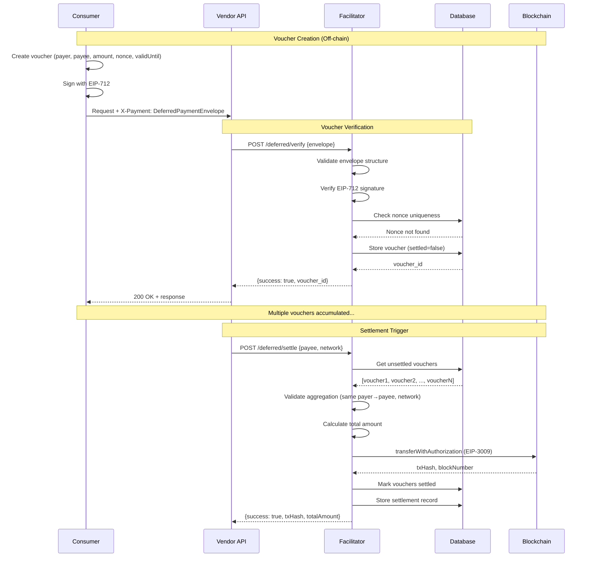

# Deferred Payment Scheme (x402 PR #426 - Option A)

Implementation of **Option A: Basic deferred scheme** from [x402 PR #426](https://github.com/coinbase/x402/pull/426) for micro-payment aggregation and batch settlement.

## Overview

The deferred payment scheme enables:
- **Off-chain vouchers** signed by payer using EIP-712
- **Voucher aggregation** to reduce gas costs
- **Batch settlement** when economic thresholds are met
- **Trust-minimized** payment guarantees through cryptographic signatures

## Use Case

Perfect for **micro-payments** where gas costs exceed payment value:
- $0.001 API calls (gas cost: ~$0.02)
- AI inference requests ($0.0001-0.01 per request)
- Streaming payments (pay-per-second/minute)
- Content micropayments (articles, images, compute)

**Example savings**:
- 1000 x $0.001 payments = $1.00 revenue
- Gas cost: 1000 x $0.02 = $20.00 (2000% overhead) ❌
- **Deferred**: 1 settlement x $0.02 = $0.02 (2% overhead) ✅

## Architecture

### Components

1. **Framework Layer** (`Selfx402Framework/src/deferred/`)
   - `types.ts` - TypeScript type definitions
   - `signing.ts` - EIP-712 voucher signing and verification
   - `validation.ts` - Business logic validation
   - `database.ts` - Supabase CRUD operations
   - `schema.sql` - Database schema

2. **Facilitator Layer** (`Selfx402Facilitator/routes/deferred.ts`)
   - `POST /deferred/verify` - Verify and store voucher
   - `POST /deferred/settle` - Aggregate and settle on-chain
   - `GET /deferred/balance/:payee` - Get accumulated balance

### Flow Diagram



## Database Schema

### `vouchers` Table

Stores off-chain payment vouchers awaiting settlement.

```sql
CREATE TABLE vouchers (
  id UUID PRIMARY KEY DEFAULT gen_random_uuid(),

  -- Voucher data
  payer_address TEXT NOT NULL,
  payee_address TEXT NOT NULL,
  amount TEXT NOT NULL,              -- Bigint as string
  nonce TEXT NOT NULL UNIQUE,        -- 32 bytes hex
  signature TEXT NOT NULL,           -- EIP-712 signature
  valid_until TIMESTAMP NOT NULL,    -- Expiration

  -- Metadata
  settled BOOLEAN NOT NULL DEFAULT false,
  network TEXT NOT NULL,             -- "celo", "celo-sepolia"
  created_at TIMESTAMP DEFAULT NOW()
);
```

**Indexes**:
- `idx_vouchers_unsettled` - Query by (payer, payee, network, settled)
- `idx_vouchers_payee` - Query by (payee, network, settled)
- `idx_vouchers_expiration` - Cleanup expired vouchers

### `settlements` Table

Records on-chain settlement transactions.

```sql
CREATE TABLE settlements (
  id UUID PRIMARY KEY DEFAULT gen_random_uuid(),

  -- Settlement data
  tx_hash TEXT NOT NULL UNIQUE,
  payee_address TEXT NOT NULL,
  payer_address TEXT NOT NULL,
  total_amount TEXT NOT NULL,
  voucher_count INTEGER NOT NULL,

  -- Metadata
  network TEXT NOT NULL,
  settled_at TIMESTAMP DEFAULT NOW(),
  voucher_ids TEXT[]                 -- Audit trail
);
```

**Setup**: Run `Selfx402Framework/src/deferred/schema.sql` in Supabase SQL Editor.

## API Reference

### POST /deferred/verify

Verify voucher signature and store in database.

**Request**:
```json
{
  "scheme": "deferred",
  "network": "celo",
  "voucher": {
    "payer": "0xPayer...",
    "payee": "0xPayee...",
    "amount": "1000",              // USDC smallest unit (6 decimals)
    "nonce": "0x...",              // 32 bytes hex
    "validUntil": 1234567890       // Unix timestamp (seconds)
  },
  "signature": "0x..."             // EIP-712 signature
}
```

**Response (Success)**:
```json
{
  "success": true,
  "verified": true,
  "voucher_id": "uuid",
  "signer": "0xPayer...",
  "expires_at": "2024-01-01T00:00:00.000Z"
}
```

**Response (Error)**:
```json
{
  "success": false,
  "error": "Invalid signature",
  "details": "Signature does not match payer address"
}
```

### POST /deferred/settle

Aggregate unsettled vouchers and settle on-chain.

**Request**:
```json
{
  "payee": "0xPayee...",
  "network": "celo",
  "payer": "0xPayer...",          // Optional: specific payer
  "minAmount": "10000000"          // Optional: $10 minimum (6 decimals)
}
```

**Response (Success)**:
```json
{
  "success": true,
  "txHash": "0x...",
  "totalAmount": "50000000",       // $50 aggregated
  "voucherCount": 50,
  "settlementId": "uuid",
  "voucherIds": ["uuid1", "uuid2", ...]
}
```

**Response (Error - Threshold)**:
```json
{
  "success": false,
  "error": "Total amount below minimum threshold",
  "totalAmount": "5000000",        // Only $5
  "minAmount": "10000000"          // Need $10
}
```

### GET /deferred/balance/:payee

Get accumulated unsettled balance for a payee.

**Request**:
```
GET /deferred/balance/0xPayee...?network=celo
```

**Response**:
```json
{
  "success": true,
  "payee": "0xpayee...",
  "network": "celo",
  "totalBalance": "150000000",     // $150 total pending
  "balancesByPayer": [
    {
      "payer": "0xpayer1...",
      "amount": "100000000",       // $100 from payer1
      "voucherCount": 100,
      "voucherIds": ["uuid1", ...]
    },
    {
      "payer": "0xpayer2...",
      "amount": "50000000",        // $50 from payer2
      "voucherCount": 50,
      "voucherIds": ["uuid2", ...]
    }
  ]
}
```

## Client Integration

### Creating and Signing Vouchers

```typescript
import {
  createVoucher,
  createVoucherDomain,
  signVoucher,
  type PaymentVoucher,
} from "@selfx402/framework";
import { useSignTypedData } from "wagmi";

const { signTypedDataAsync } = useSignTypedData();

// 1. Create unsigned voucher
const voucher: PaymentVoucher = createVoucher({
  payer: walletAddress,
  payee: vendorAddress,
  amount: BigInt(1000),           // 0.001 USDC (6 decimals)
  validityDuration: 3600,         // 1 hour (default)
});

// 2. Create EIP-712 domain
const domain = createVoucherDomain(
  42220,                            // Celo mainnet
  "0xcebA9300f2b948710d2653dD7B07f33A8B32118C" // USDC address
);

// 3. Sign voucher
const signature = await signVoucher(
  voucher,
  domain,
  signTypedDataAsync
);

// 4. Create envelope
const envelope = {
  scheme: "deferred",
  network: "celo",
  voucher,
  signature,
};

// 5. Send to vendor
const response = await fetch(`${vendorUrl}/api/endpoint`, {
  method: "POST",
  headers: { "X-Payment": JSON.stringify(envelope) },
  body: JSON.stringify({ /* request data */ }),
});
```

### Vendor Middleware

```typescript
import {
  validateDeferredEnvelope,
  type DeferredPaymentEnvelope,
} from "@selfx402/framework";

app.use(async (req, res, next) => {
  const paymentHeader = req.headers["x-payment"];
  if (!paymentHeader) return res.status(402).json({ error: "Payment required" });

  const envelope: DeferredPaymentEnvelope = JSON.parse(paymentHeader);

  // Validate structure
  const validation = validateDeferredEnvelope(envelope);
  if (!validation.valid) {
    return res.status(400).json({ error: validation.errors });
  }

  // Verify with facilitator
  const verification = await fetch(`${facilitatorUrl}/deferred/verify`, {
    method: "POST",
    headers: { "Content-Type": "application/json" },
    body: JSON.stringify(envelope),
  });

  const result = await verification.json();
  if (!result.success) {
    return res.status(401).json({ error: "Invalid voucher" });
  }

  // Attach voucher metadata to request
  req.voucherData = {
    voucherId: result.voucher_id,
    payer: envelope.voucher.payer,
    amount: envelope.voucher.amount,
  };

  next();
});
```

## Settlement Strategies

### Automatic Settlement

```typescript
import { getSettlementCandidates } from "@selfx402/framework";

// Cron job: Every hour
setInterval(async () => {
  const vouchers = await voucherDb.getUnsettledVouchers(payer, payee, "celo");

  const { shouldSettle, candidates, reason } = getSettlementCandidates(
    vouchers,
    BigInt(10_000_000),  // $10 minimum
    5                     // 5 vouchers minimum
  );

  if (shouldSettle) {
    console.log(`Settling ${candidates.length} vouchers: ${reason}`);
    const result = await fetch(`${facilitatorUrl}/deferred/settle`, {
      method: "POST",
      headers: { "Content-Type": "application/json" },
      body: JSON.stringify({
        payee,
        payer,
        network: "celo",
      }),
    });
    console.log("Settlement result:", await result.json());
  }
}, 3600_000); // Every hour
```

### Manual Settlement

Payee can trigger settlement via dashboard:

```typescript
async function settlePendingVouchers() {
  const balanceResponse = await fetch(
    `${facilitatorUrl}/deferred/balance/${payeeAddress}?network=celo`
  );
  const balance = await balanceResponse.json();

  if (balance.totalBalance < 10_000_000) {
    alert("Minimum $10 balance required for settlement");
    return;
  }

  const settlementResponse = await fetch(`${facilitatorUrl}/deferred/settle`, {
    method: "POST",
    headers: { "Content-Type": "application/json" },
    body: JSON.stringify({
      payee: payeeAddress,
      network: "celo",
    }),
  });

  const result = await settlementResponse.json();
  alert(`Settled ${result.voucherCount} vouchers: ${result.txHash}`);
}
```

## Validation Rules

### Voucher Validation

- ✅ Amount > 0
- ✅ Amount < $1000 (warn if higher - use immediate settlement)
- ✅ Payer ≠ Payee
- ✅ Valid address formats (checksummed)
- ✅ Nonce is 32 bytes hex
- ✅ Not expired (validUntil > now)
- ⚠️ Expiration < 5 minutes (warning)
- ⚠️ Expiration > 7 days (warning)

### Aggregation Validation

- ✅ Same payer address (all vouchers)
- ✅ Same payee address (all vouchers)
- ✅ Same network (all vouchers)
- ✅ No duplicates (unique nonces)
- ✅ None already settled
- ✅ All signatures valid

### Settlement Viability

```typescript
import { isSettlementViable } from "@selfx402/framework";

const totalAmount = BigInt(50_000_000);  // $50
const estimatedGas = BigInt(100_000);     // ~$0.02 on Celo

const { valid, errors, warnings } = isSettlementViable(
  totalAmount,
  estimatedGas,
  2  // Min 2x profit ratio (default)
);

// Result: valid = true (50 / 0.02 = 2500x > 2x minimum)
```

## Security Considerations

### Signature Verification

- **EIP-712** structured data signing prevents phishing
- **Nonce uniqueness** prevents replay attacks
- **Expiration** limits voucher lifetime
- **Signature recovery** validates payer identity

### Database Constraints

- **Unique nonce** constraint prevents duplicates
- **Settlement flag** prevents double-spending
- **Row Level Security** (RLS) isolates user data
- **Service role** access for facilitator only

### Attack Vectors

**Replay Attack**: Prevented by unique nonce + database check
**Double Settlement**: Prevented by `settled` flag + database transaction
**Expired Voucher**: Checked during verification + cleanup job
**Wrong Network**: Network validation in middleware + settlement

## Performance Optimizations

### Database Indexes

```sql
-- Fast unsettled voucher queries
CREATE INDEX idx_vouchers_unsettled
  ON vouchers (payer_address, payee_address, network, settled)
  WHERE settled = false;

-- Fast balance queries
CREATE INDEX idx_vouchers_payee
  ON vouchers (payee_address, network, settled);

-- Cleanup expired vouchers
CREATE INDEX idx_vouchers_expiration
  ON vouchers (valid_until, settled)
  WHERE settled = false;
```

### Batch Operations

```typescript
// Mark multiple vouchers settled in single query
await voucherDb.markVouchersSettled([
  "uuid1", "uuid2", "uuid3", ...
]);

// Aggregate query with grouping
const balances = await voucherDb.getAccumulatedBalances(payee, "celo");
```

### Cleanup Job

```typescript
// Delete expired unsettled vouchers (run daily)
const deleted = await voucherDb.deleteExpiredVouchers();
console.log(`Cleaned up ${deleted} expired vouchers`);
```

## Testing

### Unit Tests

```typescript
import { validateVoucher, createVoucher } from "@selfx402/framework";

test("validates voucher amount", () => {
  const voucher = createVoucher({
    payer: "0xPayer",
    payee: "0xPayee",
    amount: BigInt(0), // Invalid
  });

  const result = validateVoucher(voucher);
  expect(result.valid).toBe(false);
  expect(result.errors).toContain("Amount must be greater than zero");
});
```

### Integration Tests

```bash
# Test voucher creation and verification
npm run test:deferred-voucher

# Test settlement flow
npm run test:deferred-settlement

# Test balance queries
npm run test:deferred-balance
```

## Roadmap

### Phase 1 (Current) ✅
- Basic deferred scheme (Option A from PR #426)
- EIP-712 voucher signing
- Database storage and aggregation
- Manual settlement API
- Validation and error handling

### Phase 2 (Planned)
- Automatic settlement triggers
- Multi-payer aggregation
- Settlement optimization (gas price monitoring)
- Voucher expiration notifications
- Dashboard UI for payees

### Phase 3 (Future)
- **Option B**: Escrow contract settlement
- **Option C**: Commitment scheme with optimistic settlement
- Cross-network voucher support (Base, Polygon)
- Voucher marketplace (trade unsettled vouchers)
- Streaming payment support

## References

- **x402 PR #426**: https://github.com/coinbase/x402/pull/426
- **EIP-712**: https://eips.ethereum.org/EIPS/eip-712
- **EIP-3009**: https://eips.ethereum.org/EIPS/eip-3009
- **Framework Source**: `Selfx402Framework/src/deferred/`
- **Facilitator Routes**: `Selfx402Facilitator/routes/deferred.ts`
