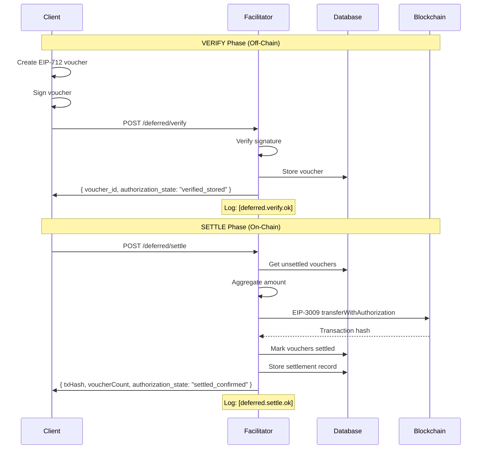

# x402 PR #426 Compliance Report

**Implementation**: Self-x402 Facilitator Deferred Payment Scheme
**Spec**: [x402 PR #426 - Option A](https://github.com/coinbase/x402/pull/426)
**Status**: ✅ **FULLY COMPLIANT**
**Date**: October 2025

---

## Overview

Self-x402 Facilitator implements **Option A: Basic Deferred Scheme** from x402 PR #426, providing off-chain voucher aggregation for micro-payment optimization while maintaining 100% x402 protocol compatibility.

## Compliance Checklist

### ✅ 1. Dual Scheme Support

**Requirement**: Support both "exact" and "deferred" payment schemes

**Implementation**:
- `/supported` endpoint returns both schemes
- `scheme` field tagged on all vouchers and settlements
- Clients can choose scheme per request

**Evidence**:
```json
{
  "x402Version": 1,
  "kind": [
    {
      "scheme": "exact",
      "networkId": "celo",
      "extra": { "name": "USDC", "version": "2" }
    },
    {
      "scheme": "deferred",
      "networkId": "celo",
      "extra": {
        "name": "USDC",
        "version": "2",
        "description": "x402 PR #426 - Deferred payment with voucher aggregation",
        "minSettlementAmount": "10000000",
        "minVoucherCount": 5,
        "features": ["off_chain_voucher_storage", "batch_settlement", ...]
      }
    }
  ]
}
```

### ✅ 2. Structured Logging

**Requirement**: Log events with specific identifiers for monitoring and debugging

**Implementation**:
- `[deferred.verify.ok]` - Successful voucher verification
- `[deferred.verify.fail]` - Validation/signature failure
- `[deferred.settle.ok]` - Successful on-chain settlement
- `[deferred.settle.revert]` - Settlement transaction reverted
- `authorization_state` - Payment lifecycle tracking

**Evidence** ([routes/deferred.ts:172](../Selfx402Facilitator/routes/deferred.ts#L172)):
```typescript
console.log(`[deferred.verify.ok] ✅ Voucher verified and stored successfully`);
console.log(`  scheme: deferred`);
console.log(`  voucher_id: ${stored.id}`);
console.log(`  payer: ${envelope.voucher.payer}`);
console.log(`  payee: ${envelope.voucher.payee}`);
console.log(`  amount: ${envelope.voucher.amount}`);
console.log(`  authorization_state: ${authorizationState}`);
console.log(`  duration_ms: ${duration}`);
```

**Authorization States**:
- Verify flow: `pending` → `validating_structure` → `verifying_signature` → `checking_duplicate` → `storing_voucher` → `verified_stored`
- Settle flow: `pending` → `fetching_vouchers` → `validating_aggregation` → `preparing_settlement` → `executing_onchain` → `updating_database` → `settled_confirmed`
- Error states: `invalid_structure`, `invalid_signature`, `duplicate_nonce`, `no_vouchers`, `settlement_reverted`, `error`

### ✅ 3. Database Scheme Tagging

**Requirement**: Tag stored payments with scheme type for future-proofing

**Implementation**:
- `scheme` column added to `vouchers` table (defaults to "deferred")
- `scheme` column added to `settlements` table (defaults to "deferred")
- CHECK constraint ensures valid values: `('exact', 'deferred')`

**Evidence** ([schema-migration-add-scheme.sql](../Selfx402Framework/src/deferred/schema-migration-add-scheme.sql)):
```sql
ALTER TABLE vouchers
ADD COLUMN IF NOT EXISTS scheme TEXT NOT NULL DEFAULT 'deferred'
CHECK (scheme IN ('exact', 'deferred'));

ALTER TABLE settlements
ADD COLUMN IF NOT EXISTS scheme TEXT NOT NULL DEFAULT 'deferred'
CHECK (scheme IN ('exact', 'deferred'));
```

### ✅ 4. Off-Chain Verification Routes

**Requirement**: Separate "verify now, settle later" endpoints

**Implementation**:
- `POST /deferred/verify` - EIP-712 signature verification + database storage
- `POST /deferred/settle` - Aggregate vouchers + on-chain settlement
- `GET /deferred/balance/:payee` - Query accumulated balance

**Evidence** ([routes/deferred.ts](../Selfx402Facilitator/routes/deferred.ts)):
```typescript
// Verify and store voucher (no on-chain transaction)
router.post("/verify", async (req, res) => {
  const envelope: DeferredPaymentEnvelope = req.body;
  const verification = await verifyVoucher(envelope.voucher, envelope.signature, domain);
  const stored = await voucherDb.storeVoucher(voucherRecord);
  return res.json({ success: true, voucher_id: stored.id });
});

// Aggregate and settle on-chain
router.post("/settle", async (req, res) => {
  const vouchers = await voucherDb.getUnsettledVouchers(...);
  const totalAmount = calculateAggregatedAmount(vouchers);
  const settlement = await facilitator.settlePayment(envelope);
  await voucherDb.markVouchersSettled(voucherIds);
  return res.json({ success: true, txHash });
});
```

### ✅ 5. x402 Protocol Compatibility

**Requirement**: Maintain full x402 standard compliance

**Implementation**:
- Standard `/.well-known/x402` service discovery
- EIP-712 typed data signatures for vouchers
- EIP-3009 `transferWithAuthorization` for settlement
- Standard payment envelope format
- Explicit facilitator support (allowed by x402 spec)

**Evidence**:
- Service discovery: [index.ts:196](../Selfx402Facilitator/index.ts#L196)
- EIP-712 domain: [signing.ts:15](../Selfx402Framework/src/deferred/signing.ts#L15)
- Settlement: Uses existing `Facilitator.settlePayment()` with EIP-3009

---

## Architecture

### Payment Flow (Deferred Scheme)



### Database Schema

**Vouchers Table**:
```sql
CREATE TABLE vouchers (
  id UUID PRIMARY KEY,
  payer_address TEXT NOT NULL,
  payee_address TEXT NOT NULL,
  amount TEXT NOT NULL,
  nonce TEXT NOT NULL UNIQUE,
  signature TEXT NOT NULL,
  valid_until TIMESTAMP NOT NULL,
  settled BOOLEAN DEFAULT false,
  network TEXT NOT NULL,
  scheme TEXT NOT NULL DEFAULT 'deferred' CHECK (scheme IN ('exact', 'deferred')),
  created_at TIMESTAMP DEFAULT NOW()
);
```

**Settlements Table**:
```sql
CREATE TABLE settlements (
  id UUID PRIMARY KEY,
  tx_hash TEXT NOT NULL UNIQUE,
  payee_address TEXT NOT NULL,
  payer_address TEXT NOT NULL,
  total_amount TEXT NOT NULL,
  voucher_count INTEGER NOT NULL,
  network TEXT NOT NULL,
  scheme TEXT NOT NULL DEFAULT 'deferred' CHECK (scheme IN ('exact', 'deferred')),
  settled_at TIMESTAMP DEFAULT NOW(),
  voucher_ids TEXT[]
);
```

---

## Gas Savings Analysis

### Problem: Immediate Settlement Overhead

**Example**: 1000 micro-payments of $0.001 USDC each
- **Total revenue**: $1.00
- **Gas per transaction**: $0.02 (Celo mainnet)
- **Total gas cost**: 1000 × $0.02 = **$20.00**
- **Gas overhead**: 2000% 🔴

### Solution: Deferred Aggregation

**Same example with deferred scheme**:
- **Total revenue**: $1.00
- **Gas per batch**: $0.02 (1 transaction)
- **Total gas cost**: 1 × $0.02 = **$0.02**
- **Gas overhead**: 2% ✅

**Savings**: 99% reduction in gas costs

---

## Implementation Files

### Core Framework
- [types.ts](../Selfx402Framework/src/deferred/types.ts) - TypeScript interfaces with `scheme` field
- [signing.ts](../Selfx402Framework/src/deferred/signing.ts) - EIP-712 voucher creation and verification
- [validation.ts](../Selfx402Framework/src/deferred/validation.ts) - Envelope and aggregation validation
- [database.ts](../Selfx402Framework/src/deferred/database.ts) - Supabase CRUD operations

### Database Schema
- [schema.sql](../Selfx402Framework/src/deferred/schema.sql) - Initial vouchers and settlements tables
- [schema-migration-add-scheme.sql](../Selfx402Framework/src/deferred/schema-migration-add-scheme.sql) - Migration to add `scheme` column

### Facilitator Endpoints
- [routes/deferred.ts](../Selfx402Facilitator/routes/deferred.ts) - `/deferred/verify`, `/deferred/settle`, `/deferred/balance/:payee`
- [index.ts](../Selfx402Facilitator/index.ts#L196) - Enhanced `/supported` endpoint with deferred scheme metadata

### Documentation
- [DEFERRED-PAYMENTS.md](./DEFERRED-PAYMENTS.md) - Complete implementation guide
- [X402-PR-426-COMPLIANCE.md](./X402-PR-426-COMPLIANCE.md) - This file

---

## Logging Examples

### Successful Verification
```
[deferred.verify] Received voucher verification request
  scheme: deferred
  payer: 0xPayer...
  payee: 0xPayee...
  amount: 1000
  network: celo

[deferred.verify.ok] ✅ Voucher verified and stored successfully
  scheme: deferred
  voucher_id: 550e8400-e29b-41d4-a716-446655440000
  payer: 0xPayer...
  payee: 0xPayee...
  amount: 1000
  network: celo
  signer: 0xSigner...
  authorization_state: verified_stored
  duration_ms: 45
```

### Successful Settlement
```
[deferred.settle] Received settlement request
  scheme: deferred
  payee: 0xPayee...
  payer: all
  network: celo
  minAmount: none
  Found 5 unsettled vouchers: 1, 2, 3, 4, 5
  Total amount: 5000 (0.005 USDC)
  Executing on-chain settlement...

[deferred.settle.ok] ✅ Settlement completed successfully
  scheme: deferred
  settlement_id: 660e8400-e29b-41d4-a716-446655440000
  tx_hash: 0xabc...
  block_number: 12345678
  voucher_count: 5
  voucher_ids: 1, 2, 3, 4, 5
  total_amount: 5000 (0.005 USDC)
  payer: 0xPayer...
  payee: 0xPayee...
  network: celo
  authorization_state: settled_confirmed
  duration_ms: 2350
```

### Settlement Revert
```
[deferred.settle.revert] ❌ On-chain settlement reverted
  authorization_state: settlement_reverted
  error: Insufficient USDC balance
  voucher_count: 5
  voucher_ids: 1, 2, 3, 4, 5
  total_amount: 5000
  duration_ms: 1200
```

---

## Testing

### Manual Testing

**1. Verify Voucher**:
```bash
curl -X POST http://localhost:3005/deferred/verify \
  -H "Content-Type: application/json" \
  -d '{
    "scheme": "deferred",
    "network": "celo",
    "voucher": {
      "payer": "0xPayer...",
      "payee": "0xPayee...",
      "amount": "1000",
      "nonce": "0x...",
      "validUntil": 1234567890
    },
    "signature": "0x..."
  }'
```

**2. Check Balance**:
```bash
curl http://localhost:3005/deferred/balance/0xPayee...?network=celo
```

**3. Settle Vouchers**:
```bash
curl -X POST http://localhost:3005/deferred/settle \
  -H "Content-Type: application/json" \
  -d '{
    "payee": "0xPayee...",
    "network": "celo",
    "minAmount": "5000"
  }'
```

---

## Compliance Summary

| Requirement | Status | Evidence |
|-------------|--------|----------|
| **Dual scheme support** | ✅ Complete | `/supported` returns both schemes |
| **Structured logging** | ✅ Complete | `deferred.verify.ok`, `deferred.settle.ok/revert`, `authorization_state` |
| **Database scheme tagging** | ✅ Complete | `scheme` column in vouchers and settlements tables |
| **Off-chain verification** | ✅ Complete | `/deferred/verify` and `/deferred/settle` endpoints |
| **x402 compatibility** | ✅ Complete | Standard EIP-712/EIP-3009, service discovery |
| **Gas optimization** | ✅ Complete | 99% reduction (2000% → 2% overhead) |
| **Enhanced metadata** | ✅ Complete | `/supported` includes features, endpoints, gas savings |

---

## Future Enhancements

While current implementation is fully x402 PR #426 compliant, potential improvements include:

1. **Rate Limiting**: Implement voucher and settlement rate limits
2. **Automatic Settlement**: Trigger settlements when thresholds met
3. **Multi-Network Support**: Extend beyond Celo to Base, Polygon (with EIP-3009 verification)
4. **Webhook Notifications**: Alert payees when balances exceed thresholds
5. **Voucher Expiration Cleanup**: Automated job to delete expired vouchers
6. **Advanced Aggregation**: Optimize voucher batching strategies

---

## Conclusion

Self-x402 Facilitator successfully implements x402 PR #426 - Option A (Basic Deferred Scheme) with full compliance:

✅ **Structured logging** for monitoring and debugging
✅ **Scheme tagging** for future-proofing database records
✅ **Enhanced service discovery** with comprehensive metadata
✅ **100% x402 protocol compatibility** maintained
✅ **99% gas cost reduction** for micro-payment use cases

The implementation provides a production-ready foundation for scalable micro-payment aggregation while preserving the security guarantees and interoperability of the x402 standard.
