# Selfx402 Product Definition

## Executive Summary

**Selfx402** is a decentralized marketplace and payment framework that combines Self Protocol's zero-knowledge identity verification with x402 micropayment protocol to create a trustless, privacy-preserving commerce platform where verified humans can instantly purchase services using cryptocurrency micropayments.

**Tagline**: "Verify once, pay instantly, access everything"

---

## Product Vision

### The Problem We Solve

1. **Identity Verification Friction**: Traditional marketplaces require lengthy KYC processes for each vendor
2. **Payment Complexity**: Crypto payments require accounts, wallets, and complex setup
3. **Bot/Sybil Attacks**: Vendors can't distinguish humans from bots without invasive verification
4. **Micropayment Inefficiency**: Traditional payment rails make small transactions ($0.001-$1.00) uneconomical

### Our Solution

Selfx402 creates a unified identity layer (Self Protocol) + instant payment layer (x402) that enables:

- **One-time verification**: Prove you're a unique human once, access all vendors
- **Instant micropayments**: Pay $0.001-$1000 per request with 2-second settlement
- **Privacy preservation**: Zero-knowledge proofs reveal nothing about your passport/identity
- **Vendor simplicity**: Accept payments and verify humans with a single integration

---

## Core Components

### 1. Selfx402 Marketplace (Consumer Portal)

**Purpose**: Discover and purchase services from verified vendors

**Features**:
- Browse vendor catalog with real-time pricing
- One-click Self verification (QR code → mobile app)
- Instant x402 payment authorization
- Service consumption tracking and history
- Savings dashboard (human vs bot pricing comparison)

**User Journey**:
```
STEP 0: ONE-TIME PASSPORT ENROLLMENT (in Self mobile app)
--------
- Download Self app (iOS/Android)
- Scan passport NFC chip (30 seconds, done once)
- Passport data encrypted and stored LOCALLY on device (never uploaded)
- Self generates zero-knowledge proofs for attributes:
  * Age (minimumAge: 18, 21, etc.)
  * Nationality (country code)
  * Gender
  * OFAC status (sanctioned country check)
  * Document type (passport, EU ID, Aadhaar)

STEP 1: FIRST-TIME VENDOR VERIFICATION (per vendor)
--------
1. Browse Selfx402 marketplace → Select vendor service → Check tier pricing
2. Vendor shows QR code with verification requirements:
   "This vendor requires: age ≥18, non-sanctioned country, OFAC compliant"
3. Scan QR code with Self app → Review disclosure request
4. Self app shows: "Share with VendorX: age ≥18 (YES/NO), nationality safe (YES/NO)"
5. User approves → Self generates ZK proof revealing ONLY:
   - ageValid: true (doesn't reveal actual age, just "≥18")
   - nationalityValid: true (doesn't reveal country, just "not sanctioned")
   - ofacValid: true
   - nullifier: "0xabc123..." (unique ID derived from passport)
6. Proof stored in browser localStorage for 90 days
7. Wallet connects → Review x402 payment (tier-based pricing) → Sign authorization
8. Service delivered instantly → Payment settled on-chain
9. Receipt stored → Service available

STEP 2: SUBSEQUENT REQUESTS (same vendor, within 90 days)
--------
1. Browse marketplace → Select same vendor service
2. Proof auto-attached from localStorage (no QR scan needed)
3. Tier automatically determined (verified human pricing)
4. Wallet connects → Sign x402 payment → Service delivered

STEP 3: RE-VERIFICATION (after 90 days)
--------
- Proof expires → Return to STEP 1 (scan QR code again)
- Passport still enrolled in Self app (no re-scan needed)
- New proof generated with fresh 90-day validity
```

### 2. Selfx402 Vendor Registry (Seller Portal)

**Purpose**: Register API endpoints, configure pricing tiers, manage membership

**Features**:
- Endpoint registration with OpenAPI/JSON Schema
- Multi-tier pricing configuration (bot/human/premium)
- Service discovery metadata (category, description, examples)
- **Membership management** (tier selection, transaction usage tracking)
- **Transaction quota monitoring** (real-time usage vs limits)
- Revenue analytics dashboard
- Webhook configuration for payment notifications

**Vendor Journey**:
```
1. Sign up → Connect wallet → Select membership tier
2. Register API endpoint → Configure x402 pricing (vendor sets amounts)
3. Set Self verification requirements (age, nationality, OFAC)
4. Deploy endpoint or use Selfx402 proxy
5. Monitor transaction quota (e.g., 23,456 / 50,000 used)
6. Receive instant settlements → Track usage analytics
7. Upgrade tier when approaching limit or add overage credits
```

**Transaction Tracking**:
- Real-time counter: "45,231 / 50,000 transactions this month"
- Quota warnings: Email at 80%, 90%, 95% usage
- Overage options: Auto-upgrade or pay-per-1000 ($0.10)

### 3. Selfx402 Facilitator (Payment Infrastructure)

**Purpose**: Verify signatures and settle x402 payments on Celo Mainnet

**Current Support**:
- ✅ **Celo Mainnet ONLY** (Chain ID: 42220)
  - USDC: `0xcebA9300f2b948710d2653dD7B07f33A8B32118C`
  - RPC: `https://forno.celo.org`
  - Explorer: `https://celoscan.io`
  - **EIP-3009 Support**: ✅ Confirmed working

**Critical Requirement**: EIP-3009 USDC Support
- ❌ **Celo Alfajores/Sepolia**: USDC doesn't support EIP-3009 (cannot be used)
- ❌ **Other Testnets**: Most testnet USDC contracts lack EIP-3009
- 📋 **Future Networks**: Must verify EIP-3009 support before integration
  - Requires USDC contract with `transferWithAuthorization` function
  - Base mainnet, Polygon mainnet (verification pending)

**Architecture**:
- Independent payment verification service
- EIP-712 signature recovery and validation
- EIP-3009 USDC settlement orchestration
- High availability with failover

**Responsibilities**:
- Validate payment authorization signatures (EIP-712)
- Execute USDC transfers on-chain via EIP-3009 `transferWithAuthorization`
- Provide payment proof to vendors
- Monitor Celo mainnet conditions and gas prices

### 4. Selfx402 Verification Backend

**Purpose**: Validate Self Protocol zero-knowledge proofs on Celo Mainnet

**Current Support** (Phase 1):
- ✅ **Celo Mainnet ONLY** (Chain ID: 42220)
  - Self Protocol Contract: `0xe57F4773bd9c9d8b6Cd70431117d353298B9f5BF`
  - Production passports (real NFC verification)
  - RPC: `https://forno.celo.org`
  - Explorer: `https://celoscan.io`

**Network Limitation**: Celo Mainnet Only
- ❌ **No Testnet Support**: Celo Alfajores/Sepolia USDC lacks EIP-3009 support
- 📋 **Future Networks**: Must verify both Self Protocol contract deployment AND EIP-3009 USDC support
  - Base mainnet (pending verification)
  - Polygon mainnet (pending verification)

**Architecture**:
- Self Protocol SDK integration (`@selfxyz/backend`)
- Nullifier deduplication database (PostgreSQL)
- Proof replay attack prevention
- Verification expiry management (90-day default)
- Multi-tenant vendor configuration

**Responsibilities**:
- Verify ZK proofs from Self mobile app (Celo mainnet contract)
- Extract and validate nullifiers (Sybil resistance)
- Check disclosure requirements (age, nationality, OFAC)
- Cache verification status with TTL (Redis)
- Provide tier determination to payment middleware

---

## Current Implementation Status (Phase 1)

### ✅ Completed Infrastructure

**x402 Payment System** (Celo Mainnet):
- Selfx402Facilitator service deployed and tested
- EIP-712 signature verification working
- EIP-3009 USDC settlement functional
- Custom middleware supporting Celo mainnet
- Payment flow: 402 → Sign → Settle → Deliver

**Network Support**:
- ✅ **Celo Mainnet ONLY** (Chain ID: 42220)
  - USDC: `0xcebA9300f2b948710d2653dD7B07f33A8B32118C` (EIP-3009 ✅)
  - RPC: `https://forno.celo.org`
  - Self Contract: `0xe57F4773bd9c9d8b6Cd70431117d353298B9f5BF`
  - Explorer: `https://celoscan.io`

### 🚧 In Development (Days 4-14)

**Self Protocol Integration** (Celo Mainnet):
- Frontend QR code generation (`@selfxyz/qrcode`)
- Backend proof verification (`@selfxyz/backend`)
- Nullifier database schema (PostgreSQL)
- Multi-tier pricing engine (bot/human/premium)
- Marketplace frontend MVP

### 📋 Future Network Expansion (Post-Residency)

**Critical Requirement**: EIP-3009 USDC Support
- All future networks must have USDC with `transferWithAuthorization` function
- Testnet expansion blocked until EIP-3009 support confirmed
- Potential candidates: Base mainnet, Polygon mainnet (verification pending)

**Why Celo Mainnet Only (Phase 1)?**:
1. ✅ EIP-3009 USDC support confirmed and tested
2. ✅ Self Protocol mainnet contract deployed (`0xe57F...5BF`)
3. ✅ Low transaction fees (<$0.01 per payment)
4. ✅ Fast block times (5 seconds)
5. ✅ Mobile-first ecosystem (matches Self app)
6. ❌ Testnets lack EIP-3009 (cannot be used)

---

## How Self Protocol Works

### Zero-Knowledge Passport Verification

**Core Concept**: Prove you're a unique human with specific attributes (age, nationality) WITHOUT revealing your actual passport data.

### Two-Stage Process

#### Stage 1: Passport Enrollment (One-Time, User Device)

**User downloads Self mobile app and scans passport:**

1. **NFC Read** (30 seconds):
   - App reads passport chip using phone's NFC
   - Extracts: Name, DOB, nationality, photo, document number, expiry
   - Data verified against chip signature (tamper-proof)

2. **Local Storage** (privacy-preserving):
   - All passport data encrypted on device
   - **NEVER uploaded to any server** (not Self, not Selfx402, not vendors)
   - User controls their data completely

3. **ZK Proof Generation** (cryptographic):
   - Self generates zero-knowledge circuits for attributes:
     * Age verification (can prove "age ≥ 18" without revealing actual age)
     * Nationality verification (can prove "not sanctioned" without revealing country)
     * OFAC compliance
     * Gender (optional)
     * Document validity (expiry check)

4. **Nullifier Creation** (Sybil resistance):
   - Unique identifier derived from passport data
   - Same passport always generates same nullifier
   - Different passports always generate different nullifiers
   - **Purpose**: Prevent one person from creating multiple "human" accounts

#### Stage 2: Vendor Verification (Per Vendor, Per 90 Days)

**When user wants to access a vendor service:**

1. **QR Code Scan**:
   - Vendor displays QR code with requirements:
     ```json
     {
       "vendor": "ImageGen API",
       "scope": "imagegen-prod",
       "endpoint": "https://api.selfx402.com/verify",
       "disclosures": {
         "minimumAge": 18,
         "excludedCountries": ["IRN", "PRK", "SYR"],
         "ofac": true,
         "nationality": true
       }
     }
     ```

2. **User Consent**:
   - Self app shows: "ImageGen API requests:"
     * ✓ Age ≥ 18 (share YES/NO only)
     * ✓ Nationality not sanctioned (share YES/NO only)
     * ✓ OFAC compliant (share YES/NO only)
   - User approves or denies

3. **ZK Proof Generation**:
   - Self creates cryptographic proof that:
     * Uses passport data stored on device
     * Proves requirements are met
     * **Reveals NOTHING about actual passport**
   - Example proof output:
     ```json
     {
       "ageValid": true,          // NOT your actual age
       "nationalityValid": true,  // NOT your actual country
       "ofacValid": true,
       "nullifier": "0xabc123...", // Unique ID (not passport number)
       "proof": "0x...",           // ZK proof (verifiable)
       "publicSignals": "0x..."    // Public inputs to proof
     }
     ```

4. **Backend Verification** (Selfx402 Verification Backend):
   - Receives proof from browser
   - Validates cryptographic proof (on-chain or off-chain)
   - Checks nullifier database:
     * Has this passport been used before for this vendor?
     * If yes: Return existing tier
     * If no: Create new verification record
   - Returns tier determination:
     ```json
     {
       "tier": "verified_human",
       "nullifier": "0xabc123...",
       "expiresAt": 1735689600,  // 90 days from now
       "disclosures": {
         "ageValid": true,
         "nationalityValid": true,
         "ofacValid": true
       }
     }
     ```

5. **Proof Caching** (Browser localStorage):
   - Store proof for 90 days
   - Subsequent requests to same vendor use cached proof
   - No QR scan needed until expiry

### Privacy Guarantees

**What vendors CANNOT see**:
- ❌ Your name
- ❌ Your actual age (only "≥18: true")
- ❌ Your actual nationality (only "not sanctioned: true")
- ❌ Your passport number
- ❌ Your photo
- ❌ Any raw passport data

**What vendors CAN see**:
- ✅ You meet age requirement (boolean)
- ✅ You meet nationality requirement (boolean)
- ✅ OFAC compliance (boolean)
- ✅ Nullifier (unique ID, not traceable to passport)

**Nullifier Role** (Sybil Resistance):
```
Passport A → Nullifier: 0xabc123...
Passport A (scanned again) → Same nullifier: 0xabc123...
Passport B → Different nullifier: 0xdef456...
```

**Database Schema**:
```sql
CREATE TABLE verifications (
  nullifier VARCHAR(66) PRIMARY KEY,  -- Unique per passport
  vendor_id UUID,
  tier VARCHAR(20),                   -- verified_human or premium_human
  age_valid BOOLEAN,                  -- true/false (not actual age)
  nationality_valid BOOLEAN,          -- true/false (not actual country)
  ofac_valid BOOLEAN,
  expires_at TIMESTAMP,               -- 90 days from verification
  created_at TIMESTAMP
);

-- One passport can only verify ONCE per vendor
-- Prevents Sybil attacks (multiple accounts from same passport)
CREATE UNIQUE INDEX idx_nullifier_vendor ON verifications(nullifier, vendor_id);
```

### Example Disclosure Scenarios

**Scenario 1: Age-Restricted Service (21+)**
```json
{
  "disclosures": {
    "minimumAge": 21,
    "ofac": true
  }
}
```
**Result**: User proves "age ≥ 21: true" without revealing they're 35

**Scenario 2: Geo-Restricted Service (US-only)**
```json
{
  "disclosures": {
    "nationality": true,
    "allowedCountries": ["USA"]
  }
}
```
**Result**: User proves "nationality = USA: true" or fails verification

**Scenario 3: Sanctions Compliance**
```json
{
  "disclosures": {
    "minimumAge": 18,
    "excludedCountries": ["IRN", "PRK", "SYR", "RUS"],
    "ofac": true
  }
}
```
**Result**: User proves "not from sanctioned country: true"

**Scenario 4: Premium Tier (Stricter Requirements)**
```json
{
  "disclosures": {
    "minimumAge": 21,
    "excludedCountries": ["IRN", "PRK", "SYR", "RUS", "CHN"],
    "ofac": true,
    "documentType": [1]  // Only passports (not EU ID or Aadhaar)
  }
}
```
**Result**: Qualifies for premium tier with 50% discount

---

## Technical Architecture

### System Flow Diagram

#### Stage 0: One-Time Passport Enrollment


#### Stage 1: First-Time Vendor Verification

```mermaid
sequenceDiagram
    actor Consumer
    participant Browser
    participant Marketplace as Selfx402 Marketplace
    participant SelfApp as Self Mobile App
    participant VendorAPI as Vendor API Endpoint
    participant VerifyBackend as Selfx402 Verification Backend
    participant Facilitator as Selfx402 Facilitator
    participant Wallet as MetaMask Wallet
    participant Celo as Celo Blockchain

    Consumer->>Browser: 1. Browse marketplace
    Browser->>Marketplace: 2. Select service
    Marketplace->>Browser: 3. Display QR code
    Note over Marketplace: Requirements: age≥18,<br/>nationality safe, OFAC

    Consumer->>SelfApp: 4. Scan QR code
    SelfApp->>Consumer: 5. Request consent:<br/>"Share age≥18: YES/NO?"
    Consumer->>SelfApp: 6. Approve
    SelfApp->>SelfApp: 7. Generate ZK proof
    Note over SelfApp: Output: {ageValid: true,<br/>nationalityValid: true,<br/>ofacValid: true,<br/>nullifier: "0xabc..."}

    SelfApp->>Browser: 8. Send proof
    Browser->>Browser: 9. Store proof (90 days)

    Browser->>VendorAPI: 10. API request<br/>(X-Self-Proof header)
    VendorAPI->>VerifyBackend: 11. Validate ZK proof
    VerifyBackend->>Celo: 12. Verify on-chain<br/>(Celo mainnet)
    VerifyBackend->>VerifyBackend: 13. Check nullifier DB:<br/>Passport used before?
    VerifyBackend->>VendorAPI: 14. Return tier: verified_human

    VendorAPI->>Browser: 15. 402 Payment Required<br/>(tier-based: $0.001)

    Browser->>Wallet: 16. Request payment
    Wallet->>Consumer: 17. Review & approve
    Consumer->>Wallet: 18. Sign EIP-712
    Wallet->>Facilitator: 19. Payment authorization
    Facilitator->>Facilitator: 20. Verify signature
    Facilitator->>Celo: 21. Execute USDC transfer<br/>(EIP-3009)
    Facilitator->>Facilitator: 22. Increment vendor<br/>transaction count
    Facilitator->>Wallet: 23. Settlement proof

    Wallet->>VendorAPI: 24. Retry with X-Payment header
    VendorAPI->>VendorAPI: 25. Validate settlement
    VendorAPI->>VendorAPI: 26. Process request<br/>(human pricing)
    VendorAPI->>Browser: 27. Service response

    Browser->>Consumer: 28. Success!<br/>✓ Saved $0.999 vs bot
```



#### Stage 2: Subsequent Requests (Cached Proof)


### Architecture Components Diagram


### Integration Points

**Vendor Integration** (3 options):

1. **Direct Middleware** (Full control):
```typescript
import { selfx402Middleware } from '@selfx402/express';

app.use('/api', selfx402Middleware({
  apiKey: process.env.SELFX402_API_KEY,  // From vendor dashboard
  verificationBackend: 'https://verify.selfx402.com',
  facilitatorUrl: 'https://facilitator.selfx402.com',

  // Network configuration (Celo mainnet only)
  network: 'celo',  // Fixed to Celo mainnet (Chain ID: 42220)
  paymentAddress: process.env.PAYMENT_WALLET_ADDRESS,

  // Vendor sets their own x402 prices
  pricing: {
    bot: '1.00',      // You control the price
    human: '0.001',   // You control the price
    premium: '0.0005' // You control the price
  },

  // Self verification requirements (Celo mainnet contract)
  verification: {
    minimumAge: 18,
    excludedCountries: ['IRN', 'PRK'],
    ofac: true,
    mockPassport: false  // Production passports only
  }
}));

// Middleware automatically:
// 1. Validates Self proof from Celo mainnet contract (0xe57F...5BF)
// 2. Determines tier (unverified/human/premium)
// 3. Returns 402 with YOUR pricing for that tier
// 4. Verifies x402 payment via Celo facilitator (EIP-3009)
// 5. Increments your transaction counter
// 6. Rejects if you exceeded monthly quota

// Current Network Support:
// ✅ Celo Mainnet ONLY (Chain ID: 42220)
// ❌ No testnet support (USDC lacks EIP-3009)
// 📋 Future: Base/Polygon mainnet (pending EIP-3009 verification)
```

2. **Selfx402 Proxy** (Hosted solution):
```bash
# Register endpoint (one-time setup)
curl -X POST https://api.selfx402.com/vendor/register \
  -H "Authorization: Bearer YOUR_API_KEY" \
  -d '{
    "endpoint": "https://your-api.com/generate",
    "pricing": {
      "bot": "1.00",      # You set the price
      "human": "0.001",   # You set the price
      "premium": "0.0005" # You set the price
    },
    "verification": { "minimumAge": 18 }
  }'

# Your API accessed via Selfx402 proxy
# https://proxy.selfx402.com/your-vendor-id/generate

# Proxy handles:
# - Self verification
# - x402 payment processing
# - Transaction quota enforcement
# - Analytics tracking
```

3. **Selfx402 SDK** (Client libraries):
```typescript
import { Selfx402Client } from '@selfx402/client';

const client = new Selfx402Client({
  walletClient: viemWalletClient,
  autoVerify: true  // Prompt Self verification if needed
});

// Client automatically handles:
// 1. Self proof submission (if verified)
// 2. 402 response → x402 payment signature
// 3. Retry with payment header
const response = await client.post(
  'https://api.vendor.com/generate',
  { prompt: 'sunset' }
);
```

**Key Points**:
- Vendors set their own x402 prices (Selfx402 doesn't modify amounts)
- Selfx402 verifies Self proofs and processes x402 payments
- Transaction quota enforced based on vendor membership tier
- Overage charges apply if quota exceeded

---

## Business Model

### Selfx402 Platform Role

**What Selfx402 Does**:
- ✅ Verifies Self Protocol KYC requirements (age, nationality, OFAC)
- ✅ Validates zero-knowledge proofs from consumers
- ✅ Processes x402 payment authorizations via facilitator
- ✅ Provides infrastructure (verification backend, facilitator, marketplace)
- ✅ Enforces vendor membership transaction limits

**What Selfx402 Does NOT Do**:
- ❌ Set or modify payment amounts (vendors set their own x402 prices)
- ❌ Take percentage of transaction value
- ❌ Control vendor pricing strategy
- ❌ Charge per-transaction fees

**Key Principle**: x402 protocol mandates that payment amounts are set by the vendor and cannot be modified by intermediaries. Selfx402 only verifies identity and processes payments.

---

### Vendor Membership Tiers

Vendors pay for infrastructure access via **membership tiers** with monthly transaction limits:

**Free Tier** (Beta/Testing)
- **Cost**: $0/month
- **Transactions**: 1,000/month
- **Features**:
  - Basic Self verification (age 18+, OFAC check)
  - Standard facilitator access
  - Marketplace listing
  - Basic analytics dashboard
- **Best for**: Testing, small projects, side projects

**Starter Tier**
- **Cost**: $29/month
- **Transactions**: 50,000/month
- **Features**:
  - Everything in Free
  - Custom verification requirements (age, nationality)
  - Priority facilitator routing
  - Email support
  - Transaction history export
- **Best for**: Growing APIs, indie developers

**Professional Tier**
- **Cost**: $99/month
- **Transactions**: 500,000/month
- **Features**:
  - Everything in Starter
  - Multi-tier pricing configuration (bot/human/premium)
  - Advanced analytics and revenue tracking
  - Custom domain support
  - Webhook notifications
  - Slack support
- **Best for**: Production APIs, small businesses

**Enterprise Tier**
- **Cost**: $499/month
- **Transactions**: 5,000,000/month
- **Features**:
  - Everything in Professional
  - Dedicated facilitator instance
  - White-label branding
  - Custom SLAs (99.99% uptime)
  - Priority support (24/7)
  - Custom verification rules
  - Revenue share options
- **Best for**: Large APIs, enterprise platforms

**Overage Pricing**: $0.10 per 1,000 transactions above tier limit

---

### Consumer Pricing (Set by Vendors)

**Important**: Vendors set their own x402 payment amounts. Selfx402 only verifies identity.

**Typical Vendor Pricing Strategies**:

**Strategy 1: Tiered Pricing** (Recommended)
- Unverified (Bot): $1.00 per request
- Verified Human: $0.001 per request (1000x discount)
- Premium Human: $0.0005 per request (2000x discount)

**Strategy 2: Human-Only**
- Unverified: Service unavailable (reject request)
- Verified Human: $0.01 per request
- Premium Human: $0.005 per request

**Strategy 3: Flat Rate with Identity**
- All tiers: $0.10 per request (same price)
- Self verification required for access (Sybil resistance)
- Rate limits vary by tier

**Strategy 4: Free for Humans**
- Unverified (Bot): $1.00 per request
- Verified Human: $0.00 (free, rate limited)
- Premium Human: $0.00 (free, higher limits)

**Selfx402's Role**: Enforce tier determination based on Self verification status, but vendor sets actual payment amounts in their x402 configuration.

---

### Revenue Model

**Primary Revenue**: Vendor memberships
- Predictable recurring revenue
- Aligned with vendor success (transaction limits)
- No per-transaction fees (simplicity)

**Secondary Revenue**: Add-on services
- Custom facilitator deployments ($500/month)
- Enterprise white-label licensing ($5,000/month)
- Consulting and integration support ($200/hour)
- Premium marketplace placement ($100/month)

**Year 1 Projection**:
- 100 vendors (50 Starter, 30 Professional, 20 Free)
- Monthly: (50 × $29) + (30 × $99) = $4,420/month
- Annual: $53,040 + $10,000 (add-ons) = **$63K**

**Year 2 Projection**:
- 1,000 vendors (500 Starter, 300 Professional, 150 Enterprise, 50 Free)
- Monthly: (500 × $29) + (300 × $99) + (150 × $499) = $104,850/month
- Annual: $1,258,200 + $200,000 (add-ons) = **$1.46M**

---

## Key Differentiators

### vs Traditional Marketplaces (Stripe, PayPal)

| Feature | Selfx402 | Traditional |
|---------|----------|-------------|
| KYC Required | Once (Self) | Per vendor |
| Micropayments | $0.0001+ | $0.50+ (fees) |
| Settlement Time | 2 seconds | 3-7 days |
| Privacy | Zero-knowledge | Full disclosure |
| Bot Protection | Cryptographic | CAPTCHAs |

### vs Web3 Marketplaces (OpenSea, Rarible)

| Feature | Selfx402 | Web3 Marketplaces |
|---------|----------|-------------------|
| Identity | Proof-of-human | Wallet only |
| Sybil Resistance | Nullifiers | None |
| Payment UX | HTTP 402 | Manual wallet TX |
| Service Types | APIs, compute | NFTs, digital assets |
| Integration | 5 lines of code | Complex smart contracts |

---

## Go-to-Market Strategy

### Phase 1: Beta Launch (Months 1-3)

**Target**: 10 vendors, 1000 verified humans

**Tactics**:
- Partner with AI API providers (image gen, LLMs)
- Developer outreach (hackathons, bounties)
- Self Protocol co-marketing
- x402 ecosystem integration

### Phase 2: Marketplace Growth (Months 4-9)

**Target**: 100 vendors, 50,000 verified humans

**Tactics**:
- Vendor success stories and case studies
- Consumer marketing (savings calculator, ROI demos)
- Integration templates for popular frameworks
- Community-driven vendor discovery

### Phase 3: Ecosystem Expansion (Months 10-18)

**Target**: 1000+ vendors, 500,000+ verified humans

**Tactics**:
- White-label platform for enterprises
- Cross-chain expansion (more networks)
- Mobile app (native Self integration)
- AI agent marketplace (autonomous buyers)

---

## Success Metrics

### Platform Health
- **Verification Conversion Rate**: Target 40%+ (users who see QR code → complete verification)
- **Payment Success Rate**: Target 99%+ (authorized payments → settled)
- **Average Savings**: Target $50+ per user per month
- **Vendor Revenue Growth**: Target 30% MoM

### User Engagement
- **Return User Rate**: Target 60%+ (verified humans who make 2+ purchases)
- **Average Basket Size**: Target $5-$20 per session
- **Time to First Purchase**: Target <3 minutes from landing

### Technical Performance
- **API Response Time**: p95 <500ms
- **Payment Settlement**: p95 <5 seconds
- **Verification Time**: p95 <60 seconds
- **System Uptime**: 99.9%+

---

## Security & Privacy

### Self Protocol Security
- Zero-knowledge proofs (passport data never leaves device)
- Nullifier-based Sybil resistance (one passport = one identity)
- Proof replay attack prevention
- 90-day verification expiry with re-verification

### Payment Security
- EIP-712 typed data signatures (phishing resistant)
- EIP-3009 transferWithAuthorization (no direct wallet access)
- Nonce-based replay protection
- Payment timeout (1-hour validity window)

### Data Protection
- No PII storage (only nullifiers and pricing tiers)
- GDPR-compliant data handling
- User-controlled data deletion
- Encrypted proof transmission

---

## Technical Requirements

### Vendor Integration Requirements
- HTTPS endpoint with TLS 1.2+
- JSON request/response format
- OpenAPI schema for service discovery
- Webhook endpoint for payment notifications (optional)

### Consumer Requirements
- Modern browser (Chrome 90+, Safari 14+, Firefox 88+)
- Self mobile app (iOS 13+, Android 10+)
- NFC-enabled smartphone (for passport scanning)
- Web3 wallet (MetaMask, Coinbase Wallet, etc.)
- **USDC balance on Celo mainnet** (Phase 1)
  - USDC Contract: `0xcebA9300f2b948710d2653dD7B07f33A8B32118C`
  - Get USDC: Swap CELO on Uniswap or Ubeswap

### Infrastructure Requirements (Phase 1)
- PostgreSQL 14+ (verification storage, nullifier database)
- Redis 6+ (rate limiting, caching)
- **Celo mainnet RPC access** (Chain ID: 42220)
  - Public RPC: `https://forno.celo.org`
  - Or Alchemy, QuickNode for production
- Domain with SSL certificate
- Self Protocol contract: `0xe57F4773bd9c9d8b6Cd70431117d353298B9f5BF`

---

## Competitive Landscape

### Direct Competitors
- **API Marketplaces**: RapidAPI, Apilayer (no proof-of-human, traditional KYC)
- **Crypto Marketplaces**: Braintrust, Chainlink Functions (no identity layer)
- **AI Platforms**: Hugging Face, Replicate (subscription-based, no micropayments)

### Strategic Advantages
1. **Only platform** combining proof-of-unique-human + instant micropayments
2. **10-100x cost reduction** for verified humans vs bots
3. **Privacy-first** approach (zero-knowledge vs full KYC)
4. **Instant settlement** (2 seconds vs 3-7 days)
5. **Sybil-resistant** by design (cryptographic vs behavioral)

---

## Roadmap

### 🎯 Self ZK Residency Phase (Oct 14 - Oct 31, 2025)

**Project Start**: October 14, 2025
**Current Date**: October 17, 2025
**Residency Deadline**: October 31, 2025 (14 days remaining)

**Completed (Days 1-3)**:
- ✅ Selfx402 payment middleware (Celo)
- ✅ Selfx402Facilitator deployment
- ✅ x402 payment flow working on Celo testnet
- ✅ Product definition and architecture design

**In Progress (Days 4-10)**:
- 🚧 Self Protocol integration
  - Frontend QR code generation
  - Backend proof verification
  - Nullifier database setup
- 🚧 Multi-tier pricing engine
  - Bot/human/premium tier logic
  - Dynamic 402 response generation
- 🚧 Marketplace frontend MVP
  - Vendor catalog UI
  - Self verification flow
  - Savings calculator demo

**Phase 1 Deliverables (by Oct 31)**:
- 📋 Working demo: Self verification → x402 payment → tiered pricing
- 📋 3 example vendor integrations (image gen, text API, compute)
- 📋 Consumer demo app with savings visualization
- 📋 Technical documentation and integration guides
- 📋 Residency presentation and demo video

### Post-Residency: Phase 2 (Nov - Dec 2025)

**Beta Launch Preparation**:
- 📋 Vendor registration portal
- 📋 Consumer dashboard with analytics
- 📋 Network expansion evaluation (Base/Polygon mainnet EIP-3009 verification)
- 📋 Production scaling (Celo mainnet)
- 📋 10 partner vendor onboarding

### Q1 2026: Market Launch

**Public Beta**:
- 📋 Public marketplace launch
- 📋 Developer documentation and SDK
- 📋 Community building (Discord, Twitter)
- 📋 Partnership announcements

### Q2-Q4 2026: Growth & Scale

**Ecosystem Expansion**:
- 📋 Mobile app (native Self integration)
- 📋 AI agent marketplace (autonomous buyers)
- 📋 White-label solution for enterprises
- 📋 Cross-chain payment routing
- 📋 Advanced analytics and reporting
- 📋 International expansion

---

## Financial Projections

### Revenue Breakdown

**Year 1**: $63,000 total
- **Vendor Memberships**: $53,040 (84%)
  - 50 Starter ($29/mo) = $17,400
  - 30 Professional ($99/mo) = $35,640
  - 20 Free ($0/mo) = $0
- **Add-On Services**: $10,000 (16%)
  - Custom facilitators, consulting, premium placement

**Year 2**: $1,458,000 total
- **Vendor Memberships**: $1,258,200 (86%)
  - 500 Starter ($29/mo) = $174,000
  - 300 Professional ($99/mo) = $356,400
  - 150 Enterprise ($499/mo) = $898,200
  - 50 Free ($0/mo) = $0
  - Overage fees = ~$30,000
- **Add-On Services**: $200,000 (14%)
  - White-label licensing, enterprise support, consulting

**Year 3**: $5,200,000 total (projection)
- **Vendor Memberships**: $4,500,000
  - 5,000+ vendors across all tiers
  - Significant enterprise adoption
- **Add-On Services**: $700,000
  - Custom deployments, integration services

### Unit Economics

**Per Vendor Costs**:
- Infrastructure (compute, storage): $2/month
- Facilitator transactions (gas): $5/month avg
- Support and operations: $3/month
- Total: **$10/month per vendor**

**Gross Margins**:
- Free Tier: -$10/month (customer acquisition)
- Starter Tier: $19/month profit (66% margin)
- Professional Tier: $89/month profit (90% margin)
- Enterprise Tier: $489/month profit (98% margin)

**Target Blended Margin**: 75%+ across all tiers

---

## Team & Resources

### Core Team Roles
- **Product Lead**: Marketplace design, vendor onboarding
- **Backend Engineer**: Facilitator, verification backend
- **Frontend Engineer**: Marketplace portal, vendor dashboard
- **DevRel**: Integration docs, developer support
- **Marketing**: Vendor acquisition, consumer education

### Key Partnerships
- **Self Protocol**: Co-marketing, technical support
- **x402 Ecosystem**: Integration with CDP facilitator
- **AI API Providers**: Early vendor partners
- **Web3 Communities**: Adoption and education

---

## Open Questions & Risks

### Technical Risks
- **Self Protocol Adoption**: What if mobile app adoption is slow?
  - *Mitigation*: Web-based verification fallback, progressive enhancement
- **Payment Network Congestion**: What if gas prices spike?
  - *Mitigation*: Multi-network support, dynamic fee estimation
- **Facilitator Downtime**: What if facilitator is unavailable?
  - *Mitigation*: Multi-facilitator failover, cached verification

### Business Risks
- **Vendor Acquisition**: What if vendors don't see value?
  - *Mitigation*: Case studies, ROI calculator, free tier
- **Consumer Education**: What if users don't understand benefits?
  - *Mitigation*: Savings calculator, comparison demos, onboarding flow
- **Regulatory Compliance**: What if verification requirements change?
  - *Mitigation*: Modular disclosure system, vendor-specific configs

---

## Appendix

### Glossary
- **Self Protocol**: Zero-knowledge passport verification system
- **x402**: HTTP-native cryptocurrency micropayment protocol
- **Nullifier**: Unique identifier derived from passport (Sybil resistance)
- **EIP-712**: Typed data signature standard (phishing resistant)
- **EIP-3009**: USDC transfer authorization standard (gasless)
- **Facilitator**: Payment verification and settlement service

### References
- Self Protocol Docs: https://docs.self.xyz
- x402 Protocol Docs: https://x402.gitbook.io
- Coinbase CDP x402: https://docs.cdp.coinbase.com/x402
- EIP-712: https://eips.ethereum.org/EIPS/eip-712
- EIP-3009: https://eips.ethereum.org/EIPS/eip-3009

---

---

## Project Timeline

**Project Start**: October 14, 2025
**Current Status** (Day 4): Self Protocol integration in progress
**Self ZK Residency Deadline**: October 31, 2025 (14 days remaining)
**Completed**: x402 payment system on Celo (Phase 1A)
**Next Milestone**: Working Self + x402 demo (Phase 1B, by Oct 31)

---

**Document Version**: 2.0
**Last Updated**: October 17, 2025
**Status**: Active Development (Self ZK Residency)
**Next Review**: October 31, 2025 (Phase 1 completion)

