# Selfx402

**Verify once, pay instantly, access everything**

Selfx402 combines [Self Protocol](https://docs.self.xyz) (zero-knowledge passport verification) with [x402](https://x402.gitbook.io) (HTTP-native crypto micropayments) to create a decentralized marketplace where verified humans pay 1000-2000x less than bots.

---

## 🎯 The Problem

- **Identity Friction**: Traditional marketplaces require lengthy KYC for each vendor
- **Bot Attacks**: Vendors can't distinguish humans from bots without invasive verification
- **Payment Complexity**: Crypto payments require accounts, wallets, complex setup
- **Micropayment Inefficiency**: Traditional rails make small transactions ($0.001-$1) uneconomical

## 💡 The Solution

**One-time verification** (Self Protocol) + **Instant micropayments** (x402) = **Tiered pricing**

```
Bot Request:    $1.00 per API call
Human Request:  $0.001 per API call (1000x cheaper)
Premium Human:  $0.0005 per API call (2000x cheaper)
```

**Key Innovation**: Cryptographic proof of unique humanity (not just "I'm human", but "I'm a unique human with a real passport") combined with instant USDC micropayments on Celo blockchain.

---

## 📱 Marketplace Preview


*The Selfx402 marketplace where consumers discover and access services with proof-of-human discounts*


*Service catalog and vendor listings with tiered pricing visualization*

---

## 🏗️ System Architecture

### High-Level Component Architecture

```mermaid
graph TB
    subgraph Client["CLIENT (Marketplace)"]
        Consumer[👤 Consumer]
        Browser[🌐 Browser/Web App]
        SelfApp[📱 Self Mobile App]
        Wallet[👛 Crypto Wallet]
    end

    subgraph SelfMiddleware["SELF PROTOCOL MIDDLEWARE"]
        QRGen[📱 QR Code Generator<br/>@selfxyz/qrcode]
        ProofCache[💾 Proof Cache<br/>localStorage/90 days]
        ClientSDK[🔧 Client SDK<br/>@selfx402/client]
    end

    subgraph Facilitator["SELFX402 FACILITATOR"]
        VerifyBackend[🔐 Verification Service<br/>@selfxyz/backend]
        PaymentFacilitator[💳 Payment Service<br/>EIP-712/3009]
        NullifierDB[(🗄️ Nullifier DB<br/>PostgreSQL)]
    end

    subgraph Vendors["VENDOR ENDPOINTS"]
        VendorMiddleware[🛡️ Selfx402 Middleware<br/>@selfx402/express]
        VendorAPI[🔌 Vendor API Logic]
        VendorServices[⚙️ Services<br/>AI, Data, Compute]
    end

    subgraph Blockchain["CELO BLOCKCHAIN"]
        SelfContract[📜 Self Verifier<br/>0xe57F...5BF]
        USDCContract[💵 USDC Token<br/>0xcebA...118C]
    end

    Consumer -->|1. Browse| Browser
    Browser -->|2. Request QR| QRGen
    QRGen -->|3. Display QR| SelfApp
    SelfApp -->|4. ZK Proof| ProofCache
    ProofCache -->|5. Store 90d| Browser

    Browser -->|6. API Request<br/>+ X-Self-Proof| VendorMiddleware
    VendorMiddleware -->|7. Verify Proof| VerifyBackend
    VerifyBackend -->|8. On-chain Check| SelfContract
    VerifyBackend -->|9. Nullifier Check| NullifierDB
    VerifyBackend -->|10. Tier Result| VendorMiddleware

    VendorMiddleware -->|11. 402 Required| Browser
    Browser -->|12. Sign Payment| Wallet
    Wallet -->|13. EIP-712 Auth| PaymentFacilitator
    PaymentFacilitator -->|14. Settle USDC| USDCContract
    PaymentFacilitator -->|15. Proof| VendorMiddleware

    Browser -->|16. Retry + Payment| VendorMiddleware
    VendorMiddleware -->|17. Process| VendorAPI
    VendorAPI -->|18. Execute| VendorServices
    VendorServices -->|19. Response| Browser

    style Client fill:#e3f2fd
    style SelfMiddleware fill:#fff3e0
    style Facilitator fill:#f3e5f5
    style Vendors fill:#e8f5e9
    style Blockchain fill:#fff9c4
    style VerifyBackend fill:#ce93d8
    style PaymentFacilitator fill:#ce93d8
    style VendorMiddleware fill:#81c784
```



### Detailed Component Flow

```mermaid
graph TB
    subgraph "Consumer Side"
        Consumer[👤 Consumer]
        Browser[🌐 Browser/Web App]
        SelfApp[📱 Self Mobile App]
        Wallet[👛 MetaMask Wallet]
    end

    subgraph "Selfx402 Platform"
        Marketplace[🏪 Marketplace Portal]
        VerifyBackend[🔐 Verification Backend<br/>Self Protocol SDK]
        Facilitator[💳 Payment Facilitator<br/>EIP-712/3009]
        DB[(🗄️ PostgreSQL<br/>Nullifier DB)]
    end

    subgraph "Vendor Side"
        VendorDashboard[📊 Vendor Dashboard]
        VendorAPI[🔌 Vendor API<br/>+ Selfx402 Middleware]
        VendorService[⚙️ Vendor Service<br/>Image Gen, LLM, etc.]
    end

    subgraph "Blockchain (Celo Mainnet)"
        Celo[⛓️ Celo Mainnet<br/>Chain ID: 42220]
        SelfContract[📜 Self Protocol<br/>0xe57F...5BF]
        USDCContract[💵 USDC Token<br/>0xcebA...118C]
    end

    Consumer -->|1. Browse| Marketplace
    Marketplace -->|2. QR Code| SelfApp
    SelfApp -->|3. ZK Proof| Browser
    Browser -->|4. Request| VendorAPI
    VendorAPI -->|5. Verify| VerifyBackend
    VerifyBackend -->|6. Validate| SelfContract
    VerifyBackend -->|7. Check| DB
    VendorAPI -->|8. 402 Response| Browser
    Browser -->|9. Sign| Wallet
    Wallet -->|10. Authorization| Facilitator
    Facilitator -->|11. Settle| USDCContract
    Wallet -->|12. Payment| VendorAPI
    VendorAPI -->|13. Service| VendorService
    VendorService -->|14. Response| Browser

    VendorDashboard -->|Register| VendorAPI
    VendorDashboard -->|Monitor| DB

    style Celo fill:#fcff52
    style SelfContract fill:#a8dadc
    style USDCContract fill:#a8dadc
    style Marketplace fill:#457b9d
    style VerifyBackend fill:#457b9d
    style Facilitator fill:#457b9d
```



---

## 🔄 How It Works

### Consumer Flow


### Vendor Flow

```mermaid
sequenceDiagram
    actor Vendor
    participant Dashboard as Vendor Dashboard
    participant Selfx402 as Selfx402 Platform
    participant VendorAPI as Vendor API
    participant Middleware as Selfx402 Middleware
    participant Consumers as Consumers

    rect rgb(240, 255, 240)
        Note over Vendor,Selfx402: Registration & Setup
        Vendor->>Dashboard: 1. Sign up
        Vendor->>Dashboard: 2. Connect wallet
        Vendor->>Dashboard: 3. Select membership tier
        Note over Dashboard: Starter: $29/mo<br/>50k transactions

        Vendor->>Dashboard: 4. Register API endpoint
        Dashboard->>Selfx402: 5. Create vendor account
        Selfx402->>Dashboard: 6. Generate API key

        Vendor->>Dashboard: 7. Configure pricing
        Note over Dashboard: Bot: $1.00<br/>Human: $0.001<br/>Premium: $0.0005

        Vendor->>Dashboard: 8. Set verification requirements
        Note over Dashboard: minimumAge: 18<br/>excludedCountries: [IRN, PRK]<br/>ofac: true

        Dashboard->>Selfx402: 9. Save configuration
    end

    rect rgb(255, 245, 240)
        Note over Vendor,Consumers: Integration
        Vendor->>VendorAPI: 10. Install middleware
        Note over VendorAPI: npm install @selfx402/express

        Vendor->>VendorAPI: 11. Add middleware code
        VendorAPI->>Middleware: 12. Initialize with API key
        Middleware->>Selfx402: 13. Register endpoint

        Note over VendorAPI,Middleware: Middleware handles:<br/>• Self proof validation<br/>• x402 payment processing<br/>• Transaction quota enforcement
    end

    rect rgb(245, 245, 255)
        Note over Vendor,Consumers: Operations
        Consumers->>VendorAPI: 14. API requests
        VendorAPI->>Middleware: 15. Process via middleware
        Middleware->>Selfx402: 16. Verify + settle
        Middleware->>VendorAPI: 17. Allow/deny request
        VendorAPI->>Consumers: 18. Service response

        Selfx402->>Dashboard: 19. Update analytics
        Vendor->>Dashboard: 20. Monitor usage
        Note over Dashboard: 23,456 / 50,000<br/>transactions used

        Dashboard->>Vendor: 21. Quota warning (80%)
        Vendor->>Dashboard: 22. Upgrade tier or add credits
    end
```



---

## 🚀 Quick Start

### For Consumers

1. **Enroll passport** (one-time, 30 seconds):
   ```bash
   # Download Self app (iOS/Android)
   # Scan passport NFC chip
   # Data stored encrypted on your device (never uploaded)
   ```

2. **Browse marketplace** → **Scan QR code** → **Approve verification**

3. **Connect wallet** → **Sign payment** → **Access service**

4. **Enjoy 1000x cheaper pricing** for 90 days (no re-scan needed)

### For Vendors

1. **Sign up** at `https://selfx402.com/vendors`

2. **Select membership tier**:
   - Starter: $29/month, 50k transactions
   - Professional: $99/month, 500k transactions
   - Enterprise: $499/month, 5M transactions

3. **Install middleware**:
   ```bash
   npm install @selfx402/express
   ```

4. **Add 5 lines of code**:
   ```typescript
   import { selfx402Middleware } from '@selfx402/express';

   app.use('/api', selfx402Middleware({
     apiKey: process.env.SELFX402_API_KEY,
     network: 'celo',  // Celo mainnet only (Phase 1)
     pricing: {
       bot: '1.00',      // Your prices
       human: '0.001',
       premium: '0.0005'
     },
     verification: {
       minimumAge: 18,
       excludedCountries: ['IRN', 'PRK'],
       ofac: true
     }
   }));
   ```

5. **Deploy** → **Start accepting payments**

---

## 🔐 Privacy & Security

### Self Protocol (Identity Layer)

**Zero-Knowledge Proofs**:
- Passport scanned **once** in Self mobile app
- Data encrypted and stored **locally** on device
- **NEVER uploaded** to any server (not Self, not Selfx402, not vendors)

**What vendors see**:
- ✅ Age requirement met: `true/false`
- ✅ Nationality requirement met: `true/false`
- ✅ OFAC compliant: `true/false`
- ✅ Nullifier (unique ID, not traceable to passport)

**What vendors CANNOT see**:
- ❌ Your name
- ❌ Your actual age (only "≥18: true")
- ❌ Your actual nationality (only "not sanctioned: true")
- ❌ Your passport number
- ❌ Your photo

**Sybil Resistance**:
- Each passport generates unique nullifier
- Same passport → same nullifier (always)
- Different passport → different nullifier (always)
- Prevents one person from creating multiple "human" accounts

### x402 Protocol (Payment Layer)

**EIP-712 Signatures**:
- Typed data signatures (phishing-resistant)
- Users see exactly what they're signing
- No direct wallet access required

**EIP-3009 USDC Transfers**:
- Gasless payments (no ETH needed for gas)
- `transferWithAuthorization` standard
- 2-second settlement on Celo blockchain

**Payment Security**:
- Nonce-based replay protection
- 1-hour validity window
- Signature verification by facilitator
- On-chain settlement proof

---

## 🌐 Network Support

### Current (Phase 1)

**Celo Mainnet ONLY** (Chain ID: 42220)
- **USDC**: `0xcebA9300f2b948710d2653dD7B07f33A8B32118C` ✅ EIP-3009
- **Self Protocol**: `0xe57F4773bd9c9d8b6Cd70431117d353298B9f5BF`
- **RPC**: `https://forno.celo.org`
- **Explorer**: `https://celoscan.io`

**Why Celo?**
1. ✅ EIP-3009 USDC support (required for x402)
2. ✅ Self Protocol mainnet contract deployed
3. ✅ Low fees (<$0.01 per payment)
4. ✅ Fast finality (5 seconds)
5. ✅ Mobile-first ecosystem


---

## 📊 Business Model

### Vendor Membership Tiers

| Tier | Price | Transactions | Features |
|------|-------|--------------|----------|
| **Free** | $0/mo | 1,000/mo | Basic verification, testing |
| **Starter** | $29/mo | 50,000/mo | Custom requirements, priority routing |
| **Professional** | $99/mo | 500,000/mo | Multi-tier pricing, advanced analytics |
| **Enterprise** | $499/mo | 5,000,000/mo | Dedicated instance, white-label, SLAs |

**Overage**: $0.10 per 1,000 transactions above tier limit

### Consumer Pricing (Set by Vendors)

**Typical vendor pricing**:
- **Unverified (Bot)**: $1.00 per request
- **Verified Human**: $0.001 per request (1000x cheaper)
- **Premium Human**: $0.0005 per request (2000x cheaper)

**Key principle**: Vendors set their own x402 prices. Selfx402 only verifies identity and processes payments.

---

## 🛠️ Tech Stack

### Selfx402 Platform

- **Verification Backend**: Node.js, Self Protocol SDK (`@selfxyz/backend`)
- **Payment Facilitator**: TypeScript, Viem, EIP-712/3009
- **Database**: PostgreSQL (nullifier deduplication)
- **Cache**: Redis (proof caching, rate limiting)
- **Blockchain**: Celo mainnet (Chain ID: 42220)

### Integration Packages

- **`@selfx402/express`**: Express.js middleware
- **`@selfx402/next`**: Next.js API routes
- **`@selfx402/client`**: Browser client (auto-payment)
- **`@selfxyz/qrcode`**: Self QR code generation (frontend)
- **`@selfxyz/backend`**: Self proof verification (backend)

---

## 📚 Documentation

### Core Documentation

- **[Docs/SELFX402-PRODUCT-DEFINITION.md](Docs/SELFX402-PRODUCT-DEFINITION.md)** - Complete product definition with architecture, business model, roadmap
- **[CLAUDE.md](CLAUDE.md)** - Developer guide for working with this codebase

### Implementation Guides

- **[Vendors/Places-x402-Api/README-CELO.md](Vendors/Places-x402-Api/README-CELO.md)** - x402 payment implementation
- **[Vendors/Places-x402-Api/CELO-X402-ARCHITECTURE.md](Vendors/Places-x402-Api/CELO-X402-ARCHITECTURE.md)** - Architecture deep-dive
- **[Selfx402Facilitator/README.md](Selfx402Facilitator/README.md)** - Payment facilitator service

### External Resources

- **Self Protocol**: https://docs.self.xyz
- **x402 Protocol**: https://x402.gitbook.io
- **Coinbase CDP x402**: https://docs.cdp.coinbase.com/x402
- **EIP-712**: https://eips.ethereum.org/EIPS/eip-712
- **EIP-3009**: https://eips.ethereum.org/EIPS/eip-3009

---

## 🎯 Project Status

### Timeline

- **Start**: October 14, 2025
- **Current**: October 17, 2025 (Day 4)
- **Deadline**: October 31, 2025 (Self ZK Residency)

### Completed ✅

- x402 payment system on Celo mainnet
- CeloFacilitator verification service
- Custom payment middleware
- Payment flow testing
- Product definition and architecture

### In Progress 🚧

- Self Protocol integration (QR code, proof verification)
- Nullifier database implementation
- Multi-tier pricing engine
- Marketplace frontend MVP

### Phase 1 Deliverables (by Oct 31)

- Working demo: Self verification → x402 payment → tiered pricing
- 3 example vendor integrations
- Consumer demo app with savings visualization
- Technical documentation
- Residency presentation

---

## 🔧 Development

### Repository Structure

```
Self-x402/
├── Vendors/
│   └── Places-x402-Api/     # Express.js API with x402 middleware (example vendor)
├── Selfx402Facilitator/     # Payment verification service
├── Selfx402App/             # Consumer application (planned)
├── Docs/                    # Documentation
│   └── SELFX402-PRODUCT-DEFINITION.md
├── Media/                   # Assets and images
├── CLAUDE.md                # Developer guide
└── README.md                # This file
```

### Running Locally

**1. Selfx402Facilitator** (Terminal 1):
```bash
cd Selfx402Facilitator
PORT=3005 npx tsx index.ts
```

**2. Vendor API** (Terminal 2):
```bash
cd Vendors/Places-x402-Api
npm run dev
```

**3. Test Payment Flow** (Terminal 3):
```bash
cd Vendors/Places-x402-Api
npm run test:celo
```

### Environment Setup

**Vendors/Places-x402-Api/.env**:
```bash
PAYMENT_WALLET_ADDRESS=0x...
NETWORK=celo
PAYMENT_PRICE_USD=0.001
FACILITATOR_URL=http://localhost:3005
```

**Selfx402Facilitator/.env**:
```bash
CELO_MAINNET_PRIVATE_KEY=0x...
CELO_MAINNET_RPC_URL=https://forno.celo.org
```

---

## 🤝 Contributing

We're in active development during Self ZK Residency (Oct 14-31, 2025).

**Current priorities**:
1. Self Protocol integration (frontend + backend)
2. Nullifier database and Sybil resistance
3. Multi-tier pricing engine
4. Marketplace frontend MVP

**Get involved**:
- Test the demo and provide feedback
- Suggest vendor use cases
- Review integration documentation
- Report bugs or UX issues

---

## 📄 License

[Specify License - MIT, Apache 2.0, etc.]

---

## 🙏 Acknowledgments

- **Self Protocol** - Zero-knowledge passport verification
- **x402 Protocol** - HTTP-native crypto payments
- **Coinbase CDP** - Payment infrastructure
- **Celo Network** - Low-cost blockchain for micropayments

---

## 📞 Contact

**Project**: Selfx402 (Self ZK Residency)
**Timeline**: October 14-31, 2025
**Status**: Active Development

---

**Built with ❤️ for the Self ZK Residency**
